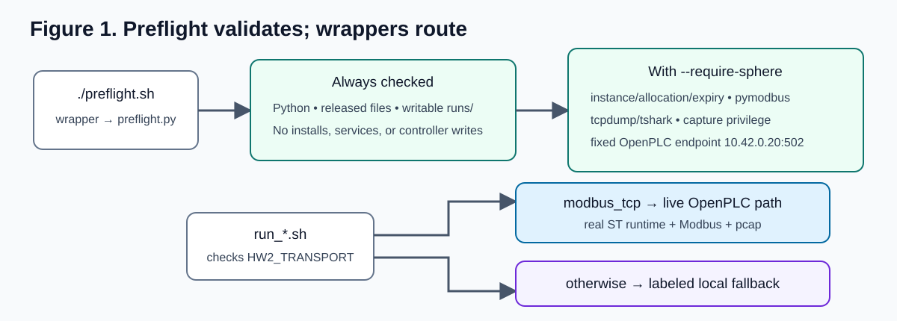
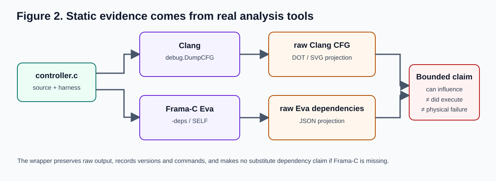
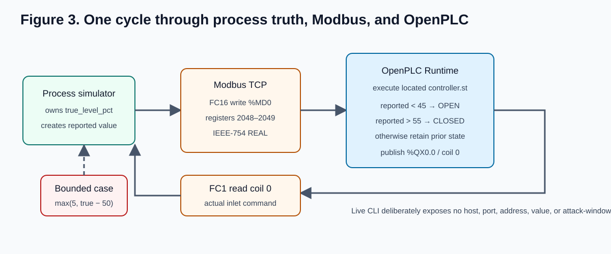
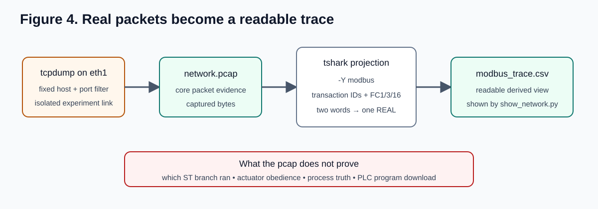
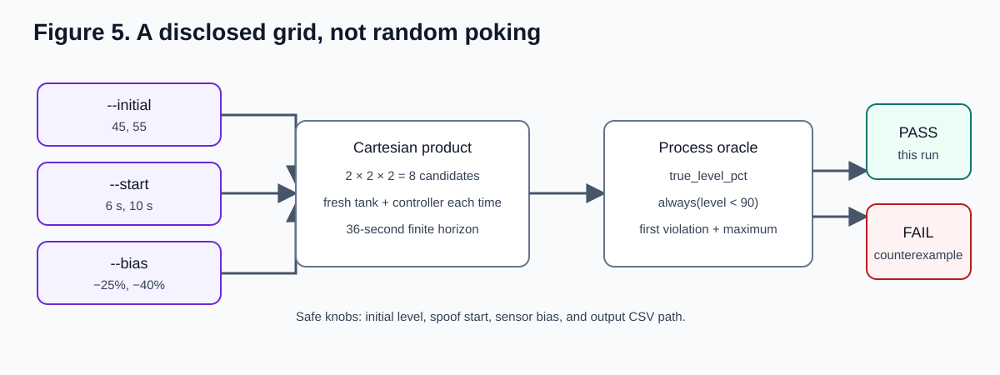
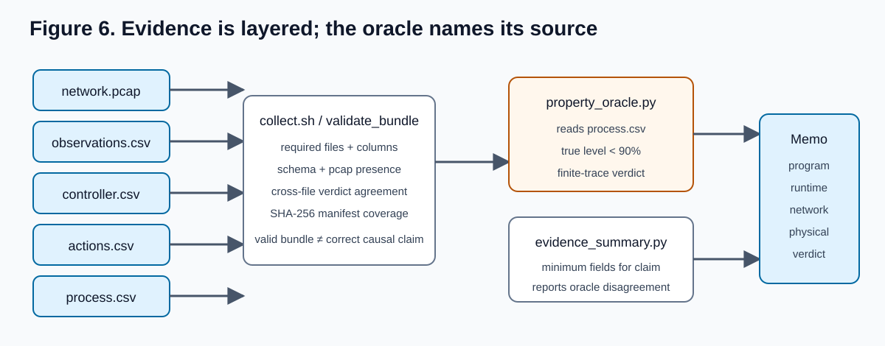
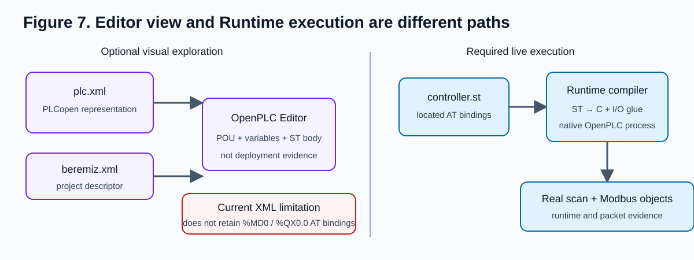
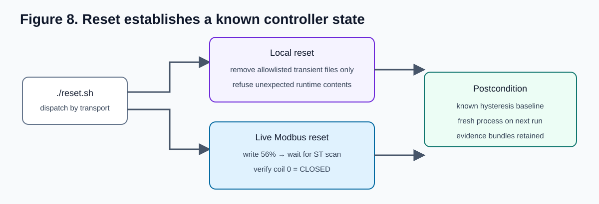

# HW2 — From Controller Logic to CPS Evidence

> **Student release.** Canvas is authoritative for the due date, submission
> mechanism, and any announced adjustments.

## Purpose

You will follow one causal chain across several views of the same small water
tank:

```text
reported level -> controller branch -> inlet command -> true tank level
```

The goal is not to master OpenPLC, packet tools, or fuzzing. The goal is to
inspect unfamiliar control logic, predict its behavior, exercise a bounded
course system, choose the right oracle, and support a limited claim with the
minimum appropriate evidence.

Expected work time: **3.5–4.5 hours** after the prepared environment passes
preflight.

## Authorization and safety boundary

Use only your assigned course realization and the fixed commands in this
assignment. The prepared manipulation can affect only the reported-level object
in your own realization, for a bounded interval. Do not enter arbitrary hosts,
ports, tags, addresses, credentials, or programs. Do not probe other course
instances. Run `./reset.sh` when directed and release the realization using
the course instructions.

## Start

On your assigned SPHERE **process node** (not the XDC shell), follow the
course-provided access instructions, then run `hw2-prepare`, enter the printed
HW2 directory, and check the prepared environment:

```bash
hw2-prepare
cd ~/cs6494-hw2/hw2
./preflight.sh --require-sphere
```

Preflight must report your instance, team, and expiry value and verify the
fixed OpenPLC endpoint and packet-capture tools. It does not itself enforce
resource expiry; follow the course release instructions. If preflight fails,
stop and send the failed line to course staff. Do not install packages. Staff
may authorize the local fallback described in [QUICKSTART.md](QUICKSTART.md)
if SPHERE is unavailable. The SPHERE process node sets
`HW2_TRANSPORT=modbus_tcp` for real OpenPLC/Modbus traffic; the local fallback
uses modeled JSON/TCP semantics and produces no pcap.

## Part A — Read the program (35–45 minutes)

**Scaffolded mechanics.** Run `./analyze.sh`. Inspect
`representations/controller.c`, the generated CFG, and the dependency map.

**Student decision.** Identify the untrusted observation, the two comparisons,
the state that survives between scans, and the final actuator decision. Trace
one feasible path that keeps the inlet open. Then list two or three assumptions
that must hold for this software influence to produce the physical property
violation, and name one reason the dependency could exist while the physical
violation remains unreachable.

**Student artifact.** An annotated dependency chain or a short CFG explanation
that names the input, retained state, decision, and output, followed by your
physical-realizability assumptions and one reachability limitation. Cite the
source or generated block supporting each step; copied reference prose is not
an analysis.

**Learning outcome.** Distinguish what static structure says *can* happen from
what a later execution says *did* happen.

**CTF1 transfer.** Read an unfamiliar controller and locate the leverage point
without being handed the answer.

## Part B — Map PLC logic and network authority (45–60 minutes)

**Scaffolded mechanics.** Inspect `representations/controller.st` and
`REPRESENTATION_MAP.md`. Map the reported REAL to `%MD0` / holding
registers 2048–2049 and the inlet BOOL to `%QX0.0` / coil 0. Inspect the
captured Modbus operations with:

```bash
./show_network.sh RUN_DIRECTORY
```

In the SPHERE path, `modbus_trace.csv` is generated from the run's real
`network.pcap`; it is not a parallel modeled record. If staff authorize the
local fallback, inspect `network_trace.csv` as a labeled semantic
reconstruction instead. `show_network.sh` is only for SPHERE pcap bundles.

**Student decision.** For each provided operation, decide who owns it, who can
observe it, whether it is a read or write, and whether it belongs to the
process/data plane or the engineering/program-management plane. Explain why a
syntactically valid or accepted write does not by itself establish that the
writer was authorized, that the controller used the value, or that the result
was safe.

**Student artifact.** A completed concept/tag/address/owner/authority table and
a two- or three-sentence explanation of why a Modbus data write is not a PLC
program download. Include one example separating protocol validity from
authorized or safe outcome. `REPRESENTATION_MAP.md` supplies the mechanical
name/address columns and leaves the assessed ownership, authority, plane, and
evidence-limit columns for you.

**Learning outcome.** Connect source intent, PLC memory, and network-visible
objects without treating representations as interchangeable proof.

**CTF1 transfer.** Discover observation and action surfaces, then bound what
each capability actually permits.

## Part C — Predict, then execute (45–60 minutes)

**Scaffolded mechanics.** Before executing, write a prediction for the nominal
case and for the prepared reported-level manipulation. Then run:

```bash
./run_nominal.sh
./run_spoof.sh
./show_evidence.sh RUN_DIRECTORY
```

For SPHERE pcap bundles, also run `./show_network.sh RUN_DIRECTORY`. Do not
run that command on local-fallback bundles; they have no `network.pcap`.

Use your own printed run directories. In the prepared SPHERE realization, the
authorized manipulation is fixed to the allowlisted reported-level seam and is
automatically bounded and logged.

**Student decision.** Identify where observed behavior first diverges from your
prediction, or state that it agrees. Follow the full chain: network operation
to controller input, branch, inlet command, and true process effect. Before the
run, name the evidence that would distinguish your nominal and manipulated
predictions. In the authorized local fallback, describe the network step as a
modeled operation, not an observed packet crossing an interface.

**Student artifact.** Your before-run prediction, the observed divergence or
confirmation, and a causal explanation citing specific timestamps/rows.

**Learning outcome.** Distinguish an accepted operation from controller
response and physical consequence; each requires separate evidence.

**CTF1 transfer.** Act inside a bounded environment and determine what actually
happened across layers.

## Part D — Bounded search and oracle (45–60 minutes)

**Scaffolded mechanics.** Choose one dimension—initial level, manipulation
start, or sensor bias—and run a small disclosed search. Example:

```bash
./search.sh --bias -20 -35 -50 --start 4 8 12
```

You are not implementing a fuzzer. You are designing a bounded search over an
allowed input or perturbation surface. Do not submit the example grid without
a hypothesis-driven justification; choose different values or explain why the
example values are appropriate for the specific boundary you are testing.

**Student decision.** Choose and justify a range and step size, including why
the selected values could expose the property violation. Identify which oracle
layer answers the physical question and explain why runner completion,
controller responsiveness, or reported state alone can miss the failure. The
primary property and checker are provided: explain why they consume process
truth rather than reported state, then either critique one limitation of the
checker or define one small secondary property.

`oracle_ladder.json` separates the whole-run reported-state verdict from
`physical_violation_onset_detection`. For a violating run, compare their
inputs, sampling points, and timestamps. Explain any agreement or disagreement
from your own trace; do not infer timely controller awareness from a later
sample alone.

**Student artifact.** A compact search table or plot plus the explored space,
oracle, and your checker critique or secondary property. If you find a
violation, describe it as a concrete counterexample under the tested model,
starting state, input space, and horizon. If you do not, state the search bounds
and explicitly explain why the negative result does not prove safety.

**Learning outcome.** Use systematic finite testing to look beyond one
execution while keeping the claim bounded.

**CTF1 transfer.** Replace random poking with a deliberate investigation
strategy.

## Part E — Evidence-backed conclusion (30–45 minutes)

**Scaffolded mechanics.** Use `timeline.csv`, `oracle_ladder.json`, and
`property_results.json`. In the SPHERE path, also use `network.pcap` and its
derived `modbus_trace.csv`. In an authorized local fallback, use
`network_trace.csv` only as a semantic reconstruction, not packet evidence.
Consult source-layer files only when your claim needs them. A real pcap
establishes interface traversal and a Modbus operation, not the controller
branch, actuator response, or physical consequence by itself.

**Student decision.** Select the minimum evidence needed to support each layer
of your conclusion. Keep program-level capability, runtime observation,
network/authority evidence, physical/process evidence, and the property verdict
separate rather than treating one layer as proof of another. Complete the
worksheet in `EVIDENCE_REFERENCE.md` with exact rows, timestamps, packet
transactions, or source blocks from your run.

**Student artifact.** A concise investigation memo containing:

1. what the program structure shows is possible;
2. what actually executed at runtime;
3. what the network/authority evidence shows was read or written, and by whom;
4. what the simulated physical process did;
5. the relevant CPS property, its verdict, and why the chosen oracle supports it;
6. the minimum evidence supporting each claim layer;
7. the strongest bounded claim you can defend and one stronger unsupported claim;
8. which parts of the experiment are real, emulated, or simulated, and one claim
   that would require higher fidelity than this lab provides.

For a fallback run, explicitly mark packet-traversal and real OpenPLC claims
as **not tested**; do not infer them from modeled network rows.

**Learning outcome.** Match evidence to claims and disclose assumptions and
limits.

**CTF1 transfer.** Produce an evidence-backed postmortem rather than merely
reporting success or failure.

## Finish and recover

```bash
./reset.sh
```

Confirm your evidence still exists, download the required bundle/memo, and
stop or release your assigned realization using the course-provided control.

## Instructor demonstration — not required student work

The instructor may compare baseline and modified teaching ST through a
TSV-lite bounded safety gate, then show a supported program deployment and
restore in an isolated environment. The exact interpretation is:

> TSV-lite asks the same architectural question: should a candidate controller
> pass a bounded safety check before deployment?

`ACCEPT` means only that no violation was observed in the disclosed finite
scenarios and assumptions. It is not formal proof, model checking, or the
original TSV implementation. Program hash change, behavior change, and unsafe
physical consequence remain three different claims.

## Submission

- Parts A–D responses;
- Part E investigation memo;
- the requested nominal/manipulated evidence identifiers or bundles;
- search results; and
- confirmation that reset/release completed.

## Deeper Dive appendix (optional)

This appendix is not required and carries no penalty if skipped. It exposes
what each wrapper does, how the layers map to real tooling, and which parameters
are safe to vary. The figures are explanatory maps; the named source files and
captured artifacts remain authoritative.

### 1. Preflight and execution routing



`preflight.sh` wraps `preflight.py`. The base check verifies Python, released
files, and a writable evidence directory. In a prepared realization,
`./preflight.sh --require-sphere` additionally checks course identity and
expiry, Clang, Graphviz, Frama-C, `pymodbus`, `tcpdump`, `tshark`, fixed capture
privilege, and the fixed OpenPLC endpoint. The run wrappers then select the live OpenPLC/Modbus path
only when `HW2_TRANSPORT=modbus_tcp`; otherwise they select the labeled local
fallback. Preflight validates but does not install, start, or modify anything.

### 2. Static-analysis scaffold



`analyze.sh` orchestrates two real analysis tools. Clang's
`debug.DumpCFG` generates the C control-flow blocks and edges; Frama-C Eva
and `-deps` report which inputs may affect the valve decision, including
`SELF` when the previous state can be retained. `static_view.py` only
converts those outputs to `controller_cfg.dot`/`.svg` and
`dependency_map.json`. The original tool output is retained under `raw/`;
`TOOLCHAIN.md` records the exact versions, commands, source hash, harness
assumptions, and limits. Try `./analyze.sh --out runs/my-analysis`. Analyze
a *copy* of the C source with
`./analyze.sh --source /path/to/controller-copy.c --out runs/edited-analysis`;
the live PLC is unaffected. On a local machine without Frama-C, the script
clearly marks dependencies unavailable rather than substituting an imitation.
On the prepared SPHERE node, missing Frama-C is an error. A CFG or possible
dependency does not establish execution, packet traversal, or physical
reachability. See [the full toolchain map](TOOLCHAIN.md).

### 3. One OpenPLC/Modbus cycle



In the live path, `modbus_tank_run.py` writes the reported REAL as one FC16
register pair at 2048–2049, waits for the actual OpenPLC scan, reads coil 0
with FC1, and advances simulator-owned process truth. The live CLI intentionally
has no host, port, address, value, or attack-window option. In the local
fallback you may safely explore timing in a fresh bundle:

```bash
./run_case.sh sensor_spoof --duration 48 --tick 0.5 --out runs/spoof-48s
```

### 4. Packet capture and decoding



The prepared capture wrapper runs `tcpdump` on the isolated interface into
`network.pcap`; it does not grant general privileged packet capture.
`show_network.py` invokes the real `tshark` CLI, filters Modbus, correlates
requests and responses by transaction ID, and decodes the two `%MD0` words as
one IEEE-754 REAL. The live bundle's `TOOLCHAIN.json` records the actual
capture/decode commands and tool versions. On your own capture, try the
read-only filter:

```bash
tshark -r RUN_DIRECTORY/network.pcap -Y 'modbus.func_code == 16'
```

Change display fields or filters, not live targets, hosts, or addresses.

### 5. Bounded parameter search



`search.sh` forwards to `search_cases.py`. It takes the Cartesian product of
`--initial`, `--start`, and `--bias`; every candidate starts with a fresh tank
and controller state and runs for a disclosed 36-second horizon.

```bash
./search.sh --initial 45 55 --start 6 10 --bias -25 -40 --out runs/my-grid.csv
```

Read `evaluate()` to inspect the 5% reported-value floor, state-update order,
and oracle sampling point. These are experiment parameters, not network
targets.

### 6. Evidence validation and oracle



`collect.sh` checks required files, columns, schema version, pcap presence,
cross-file verdict agreement, and the SHA-256 manifest. `property_oracle.py`
records the selected trace field and evaluates
`always(true_level_pct < 90)`. Your graded explanation must justify that field
against at least one alternative. For a non-writing sensitivity check, try:

```bash
python3 property_oracle.py RUN_DIRECTORY --max-level 85 --no-write
```

Keep the required 90% verdict unchanged and label the alternate threshold.

### 7. Bonus: inspect the program in OpenPLC Editor



In OpenPLC Editor v3, choose **Open Project** and select the entire
`representations/openplc_editor_project` folder. Expand
`HW2TankController`; compare its interface and body with
`representations/controller.st`; then locate the retained valve state and both
threshold branches. The project is a visual PLCopen representation. Its XML
does not retain the ST `AT` bindings, so it cannot replace the located ST used
by the live Runtime or prove deployment. Edit only a copy.

### 8. Reset semantics



`reset.sh` dispatches by transport. The local path deletes only allowlisted
transient files and retains evidence. The live path writes a disclosed 56%
initialization value, waits for the ST scan, and verifies that coil 0 is CLOSED.
That explicitly restores retained hysteresis state instead of assuming a new
shell or page load reset the PLC.
